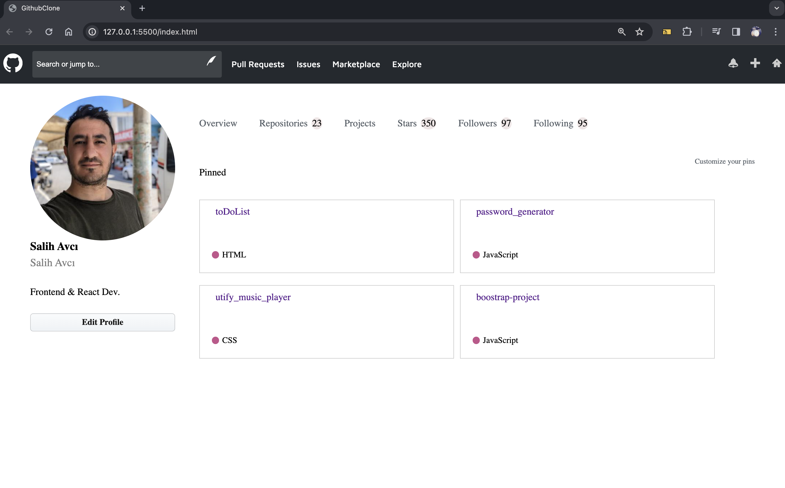

# GithubClone Ekran Görüntüsü

**Geliştirici: Salih Avcı**
- Frontend & React Geliştirici

## Genel Bakış

GitHubClone'a hoş geldiniz! Bu proje, GitHub arayüzünden ilham alınarak oluşturulmuş bir web sayfasıdır. GitHub'ın görünüm ve hissini çoğaltmak için çeşitli bileşenler ve simgeler içerir.

## Özellikler

- HTML ve CSS ile duyarlı tasarım.
- Temiz ve modern bir kullanıcı arayüzü için SVG simgelerini kullanır.
- Tipografi için Google Fonts (Maven Pro) kullanımını gösterir.
- Navigasyon bağlantıları ve bir arama çubuğu içeren bir başlık bölümü bulunur.
- Kullanıcı bilgilerini ve projeleri ana bölümde sergiler.
- Sabitlenmiş proje bölümü ile özelleştirilebilir pinler.

## Projeler

### 1. toDoList
- **Dil:** HTML
- [Proje Bağlantısı](#)

### 2. password_generator
- **Dil:** JavaScript
- [Proje Bağlantısı](#)

### 3. utify_music_player
- **Dil:** CSS
- [Proje Bağlantısı](#)

### 4. boostrap-project
- **Dil:** JavaScript
- [Proje Bağlantısı](#)

## Nasıl Kullanılır

1. Depoyu kopyalayın: `git clone https://github.com/avcisalih/githubClone`
2. `index.html` dosyasını tarayıcınızda açın.

Keşfetmekte, katkıda bulunmakta veya geri bildirimde bulunmakta özgürsünüz! Herhangi bir sorunuz veya öneriniz varsa [bir sorun açın](#) veya [iletişime geçin](#).

İyi kodlamalar!
